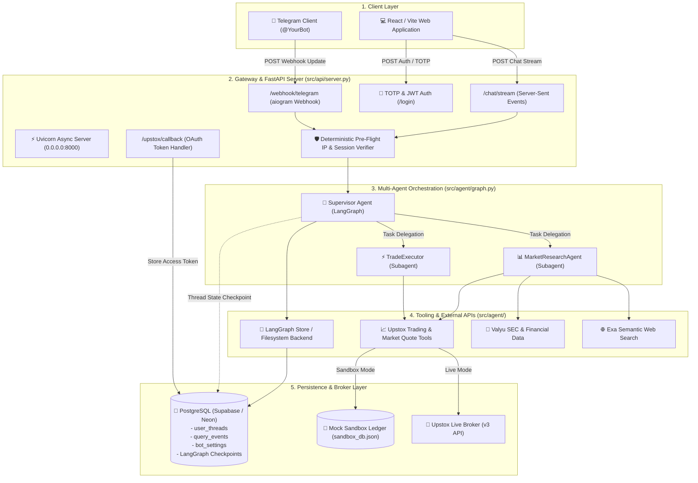
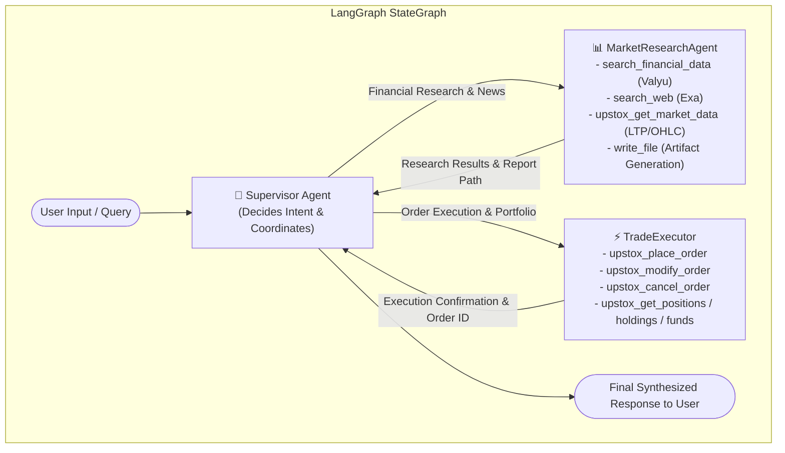
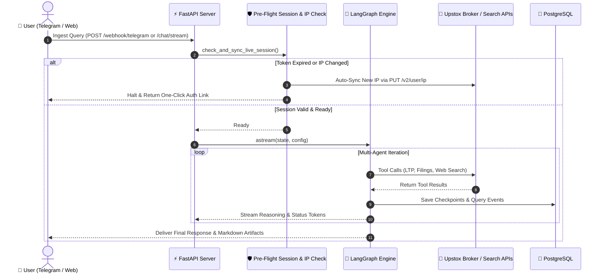
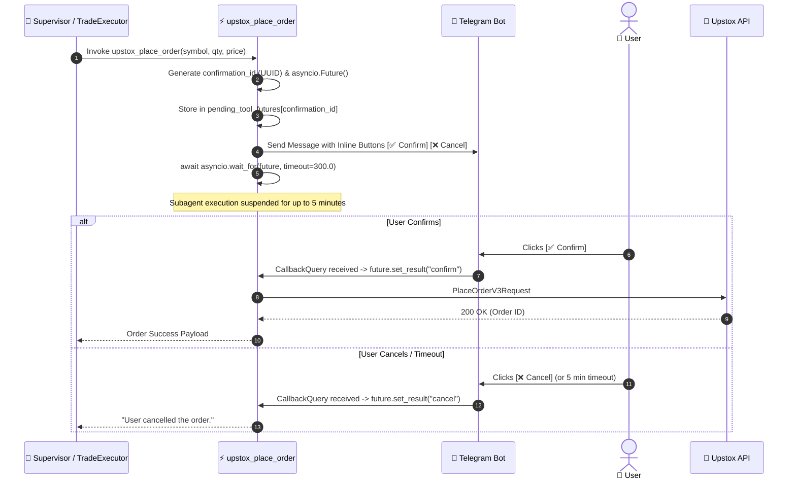
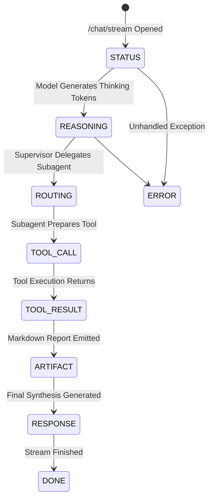

# [DeepTrade] - ARCHITECTURE & KNOWLEDGE SKILL FILE



---

## 1. System Overview & Core Value Prop
- **High-Level Purpose:** An autonomous financial research and analysis agent system that gathers real-time market data, web intelligence, and SEC filings to synthesize structured research reports and execute live trades interactively via both a Web UI and a Telegram Bot.
- **Primary Tech Stack:** Python (FastAPI, Uvicorn, LangChain/LangGraph, DeepAgents), Telegram Bot API (`aiogram`), Node.js (Vite, React, TypeScript, SWC/Oxc) for the UI frontend, PostgreSQL (Supabase) with `psycopg_pool` for backend persistence, and OpenRouter for LLM inference (`poolside/laguna-s-2.1:free`, `nvidia/nemotron-3.5-lightning:free`).
- **Key Constraints/Design Philosophy:** Event-driven and highly observable. Relies heavily on Server-Sent Events (SSE) streaming for the Web UI and background task webhooks for Telegram to surface granular agent interactions (reasoning tokens, tool calls, and artifact emissions). Operates a multi-agent orchestrated graph (Supervisor ➔ Subagents). State is checkpointed to Postgres implicitly via LangGraph abstractions.

---

## 2. Multi-Agent Graph Topology & Delegation Flow



### Directory Structure & Component Mapping
- `main.py`: Application entry point; bootstraps the FastAPI server via Uvicorn.
- `src/api/server.py`: Defines the FastAPI application, mounts CORS, handles DB lifespan initialization, and exposes the crucial SSE streaming endpoint (`/chat/stream`) and thread management APIs.
- `src/api/telegram_bot.py`: Implements the Telegram Bot integration using aiogram webhooks, mapping Telegram commands to LangGraph execution threads.
- `src/api/db.py`: Manages the global async connection pool (`psycopg_pool`) to PostgreSQL, initializes the LangGraph checkpointer (`AsyncPostgresSaver`) and store (`AsyncPostgresStore`), and performs deterministic pre-flight token & static IP sync checks.
- `src/api/logging_utils.py`: Provides deterministic query ID generation and configures concurrent file/stream loggers to track agent execution per request.
- `src/agent/graph.py`: Constructs the `deep_agent` multi-agent graph, wiring the Supervisor to subagents and injecting a `CompositeBackend` to route artifact storage to Postgres.
- `src/agent/nodes/market_research_agent.py`: Subagent definition responsible for fetching raw financial data, SEC filings, web content, and Upstox market data.
- `src/agent/nodes/trade_executor.py`: Subagent definition responsible for executing trades, modifying/cancelling orders, and fetching portfolio data (holdings, funds) securely via Upstox.
- `src/agent/tools.py`: Implements external search integrations (`search_financial_data` using Valyu and `search_web` using Exa).
- `src/agent/upstox_tools.py`: Implements the Upstox API tool wrappers (fetching orders, placing orders with Telegram confirmation, etc.).
- `src/agent/models.py`: Instantiates the OpenRouter LLM (`ChatOpenAI`) and implements a monkey-patch to capture proprietary reasoning tokens.
- `src/agent/config_loader.py`: Dynamically loads Markdown-based system prompts from `src/agent/config/prompts/` to feed the subagents.
- `src/ui/`: Isolated Vite+React frontend application utilizing a modern, strict TypeScript setup and Oxlint.

---

## 3. End-to-End Control Flow & Execution Paths



### Primary Execution Path 1: Web UI Request (`/chat/stream`)
1. **API Ingestion:** `src/api/server.py` (`chat_stream`) receives `ChatRequest`, generates a `query_id`, and opens a streaming response returning `generate_sse_events()`.
2. **Pre-Flight Session Check:** `check_and_sync_live_session()` validates token and IP before invoking the graph.
3. **Background Execution:** `generate_sse_events` drops a `SystemMessage` and `HumanMessage` into the state and dispatches `run_graph()` to run inside an `asyncio.create_task()`.
4. **SSE Streaming:** Emits `REASONING`, `TOOL_CALL`, `TOOL_RESULT`, `ARTIFACT`, and `RESPONSE` events.

### Primary Execution Path 2: Telegram Bot Request (`/webhook/telegram`)
1. **API Ingestion:** Telegram sends a JSON update to the webhook endpoint. `src/api/telegram_bot.py` processes the message and drops it into a `BackgroundTasks` queue to return a fast `200 OK` to Telegram.
2. **Pre-Flight Session Check:** Evaluates live token readiness and static IP whitelist.
3. **Background Execution:** The background task drops a `HumanMessage` into the state and dispatches `run_graph()`. Intermediate steps (reasoning, tool calls) are safely swallowed or summarized, while final text responses and Markdown artifacts are transmitted back to the user via the `aiogram` Bot instance.
4. **Event Interception & Logging:** As the Supervisor and subagents emit updates, `run_graph` parses them into distinct `log_type`s (e.g., `REASONING`, `TOOL_CALL`, `ARTIFACT`).
5. **Persistence & Broadcast:** `src/api/db.py` (`insert_event`) asynchronously writes these events into the `query_events` Postgres table while simultaneously pushing the raw JSON data to the `asyncio.Queue` feeding the SSE stream.
6. **External Tooling:** If a tool call occurs, `src/agent/tools.py` hits Valyu or Exa, returning the raw text string back into the LangGraph state loop.

---

## 4. Interactive Order Confirmation & Async Future Resolution



---

## 5. State Management, Data Models & Persistence
- **Data Lifecycle:** The system relies entirely on Postgres for truth. LangGraph manages the thread state implicitly via checkpoints. Transitory execution events (what tools ran, what reasoning occurred) are captured manually via `run_graph` and stored as append-only records to hydrate the UI later.
- **Key Models/Schemas:**
    - `user_threads`: Custom Postgres table tracking basic thread metadata (`thread_id`, `title`, timestamps).
    - `query_events`: Custom append-only table logging granular agent actions (`log_type`, `agent`, `content`, `event_metadata`).
    - `bot_settings`: Key-value configuration store storing `UPSTOX_LIVE_ACCESS_TOKEN`, `WEBHOOK_DOMAIN`, `ADMIN_CHAT_ID`, and `LAST_SYNCED_STATIC_IP`.
- **Side Effects & Caching:** `write_file` tool calls prefixed with `/research/` are hijacked by `StoreBackend` (configured in `src/agent/graph.py`) and stored natively into the LangGraph Postgres `store` namespace. No external caching (e.g., Redis) is utilized.

---

## 6. Cross-Cutting Concerns
- **Authentication & Authorization:** The platform utilizes a robust TOTP (Time-Based One-Time Password) mechanism. `pyotp` validates user-provided authenticator codes against the `WEB_OTP_SECRET` stored in the environment. Upon successful verification, a JWT token (`PyJWT`) is generated, establishing a secure session valid for 7 days across both the Web UI and API endpoints.
- **Error Handling Strategy:** In `src/api/server.py`, the `run_graph` background task wraps graph execution in a generic `try/except`. Errors log locally and are squashed into a standardized `{"type": "error", "content": ...}` JSON block pushed down the SSE stream to prevent dropped client connections.
- **LLM Reasoning Extraction:** `src/agent/models.py` uses an active monkey-patch on `langchain_openai.chat_models.base._convert_delta_to_message_chunk` to forcefully inject OpenRouter's `reasoning` chunk stream into `message_chunk.additional_kwargs`.

---

## 7. API Data Models & SSE Event Schemas

### Request Models (Pydantic)
**Chat Request (`POST /chat/stream`)**
```python
class ChatRequest(BaseModel):
    message: str                        # The user's prompt
    thread_id: Optional[str] = None     # Binds request to existing conversation state
    hidden_instruction: Optional[str] = None # System instruction pre-pended to state
```

**Thread Request (`POST /threads`)**
```python
class ThreadCreateRequest(BaseModel):
    title: str                          # Name of the conversation thread
```

### Database Schemas (Postgres)
**`user_threads`**
- `thread_id` (TEXT, PK): Unique identifier for the LangGraph thread state.
- `title` (TEXT): Display name for UI.
- `created_at` / `updated_at` (TIMESTAMP): Standard lifecycle tracking.

**`query_events`**
- `id` (SERIAL, PK)
- `thread_id` (TEXT, FK): Maps to `user_threads`.
- `query_id` (TEXT): Unique ID grouping logs of a single `/chat/stream` request.
- `log_type` (TEXT): Categorical type of the event.
- `agent` (TEXT): Which agent generated the event (e.g., `Supervisor`, `DataCollector`).
- `content` (TEXT): Stringified event payload.
- `event_metadata` (JSONB): Parsed JSON metadata (like tool args or subagent names).

### Server-Sent Events (SSE) Schemas



- **STATUS**: Initial state emission (`{"type": "status", "content": "Initializing research..."}`).
- **REASONING**: Emits live LLM thinking tokens (`{"type": "log", "log_type": "REASONING", "agent": "Supervisor", "content": "Thinking...", "id": "msg_id"}`).
- **ROUTING**: Identifies Supervisor delegating tasks (`{"type": "log", "log_type": "ROUTING", "agent": "Supervisor", "subagent": "DataCollector", "content": "Instructions..."}`).
- **TOOL_CALL**: Agent requests to use a tool (`{"type": "log", "log_type": "TOOL_CALL", "agent": "DataCollector", "tool": "search_web", "content": "{\"query\": \"AAPL\"}"}`).
- **TOOL_RESULT**: External API response payload (`{"type": "log", "log_type": "TOOL_RESULT", "agent": "DataCollector", "tool": "search_web", "content": "Raw search results..."}`).
- **TASK_RESULT**: Subagent returning results to Supervisor (`{"type": "log", "log_type": "TASK_RESULT", "agent": "Supervisor", "tool": "task", "content": "..."}`).
- **ARTIFACT**: A saved markdown document generated during research (`{"type": "log", "log_type": "ARTIFACT", "agent": "FinancialAnalyst", "path": "/research/report.md", "content": "Markdown body..."}`).
- **RESPONSE**: Final output provided to the user (`{"type": "log", "log_type": "RESPONSE", "agent": "Supervisor", "content": "Final synthesis..."}`).
- **DONE**: Stream successfully finished (`{"type": "done"}`).
- **ERROR**: Graph execution failed (`{"type": "error", "content": "Exception message"}`).

---

## 8. SDK Gotchas, Workarounds & Hardening

1. **Singleton Configuration Bug in Upstox Python SDK**:
   - The Upstox Python SDK generated via Swagger Codegen contains a bug in its `Configuration` class that behaves similarly to a shared global singleton. Setting `sandbox=True` on subsequent instantiations fails to properly update the `order_host`.
   - **Resolution**: DeepTrade explicitly overrides both `config.host` and `config.order_host` to their correct endpoints in `src/agent/upstox_client_manager.py` every time an API client is constructed.

2. **Urllib3 Incompatibility**:
   - The Upstox SDK internally uses `urllib3.get_host(url)`, which was deprecated and removed in `urllib3 >= 2.0.0`.
   - **Resolution**: A monkey-patch was introduced in `src/agent/upstox_tools.py` that polyfills `urllib3.get_host` using `urllib3.util.parse_url`.

3. **Silent Database Fallback**:
   - If `PG_DATABASE_URL` is missing from the environment, `src/api/db.py` intentionally logs a warning while setting `db._pool = None`. The in-memory graph will function, but thread state and tokens will not persist across restarts.
