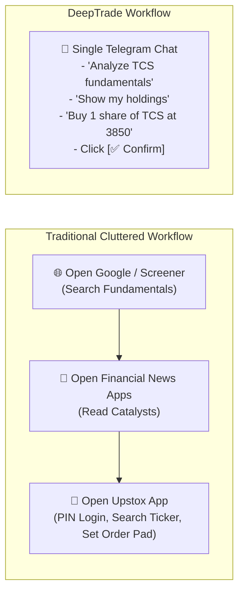

# DeepTrade: Open-Source Strategy, Market Research & Launch Playbook 📈🚀

This document outlines the marketing, launch strategy, positioning, and distribution playbooks for open-sourcing DeepTrade as a **conversational financial research & direct Upstox execution assistant**.

---

## 📑 Table of Contents
1. [Core Value Proposition & Real Use Case](#1-core-value-proposition--real-use-case)
2. [Why Users Love It: The Workflow Problem Solved](#2-why-users-love-it-the-workflow-problem-solved)
3. [Target Audience Personas & Value Hooks](#3-target-audience-personas--value-hooks)
4. [Multi-Channel Distribution Strategy (Platform-by-Platform)](#4-multi-channel-distribution-strategy-platform-by-platform)
   - [Reddit Launch Blueprints](#a-reddit-launch-blueprints)
   - [X / Twitter Launch Thread](#b-x--twitter-launch-thread)
   - [Hacker News (Show HN)](#c-hacker-news-show-hn)
   - [Upstox & Indian Trader Communities](#d-upstox--indian-trader-communities)
5. [Video & Demo Strategy](#5-video--demo-strategy)
6. [Future Product & Feature Roadmap](#6-future-product--feature-roadmap)
7. [Archive: Cross-Industry Research Agent Ideas](#7-archive-cross-industry-research-agent-ideas)

---

## 1. Core Value Proposition & Real Use Case

DeepTrade is **NOT** an automated algorithmic trading bot or a black-box signal generator.

It is a **personal conversational broker assistant and equity research terminal** that runs directly inside **Telegram** (and Web UI). It connects real-time financial search tools (**Valyu** for SEC filings/fundamentals, **Exa** for web intelligence) with the **Upstox API v3**, allowing users to perform deep research and execute commands on their own Upstox account using natural language—**without ever having to open or log into the Upstox app**.



### Key Pillars:
- **Zero App Switching**: Check holdings, open positions, available margin, order book, or place/modify/cancel trades from one chat interface.
- **Deep AI Equity Research**: Instant valuation metrics, peer comparisons, and recent news synthesized on demand.
- **Two-Step Human Confirmation**: The bot never executes orders automatically. It drafts the preview and awaits explicit tap on `[✅ Confirm]`.
- **100% Self-Hosted & Secure**: Runs locally on the user's machine (or private cloud). Broker API secrets and tokens stay completely private.
- **Deterministic Pre-Flight Verification**: Automatically checks token validity and syncs dynamic ISP IP changes with Upstox before sending requests to the LLM.

---

## 2. Why Users Love It: The Workflow Problem Solved

| Daily Trading Task | Old Way (Without DeepTrade) | DeepTrade Way |
| :--- | :--- | :--- |
| **Researching a Stock** | Open browser, visit Screener.in, search news on Google, parse 10 tabs. | Type `/analyse INFY` or `/news EV sector` in Telegram. Receive clean structured summary in seconds. |
| **Checking Portfolio / Margin** | Unlock phone, open Upstox app, enter 6-digit PIN, navigate to Portfolio tab. | Type *"Show my open positions"* or *"What is my available margin?"* in Telegram. |
| **Placing / Modifying an Order** | Search instrument in Upstox, choose Product type, enter Limit price, swipe to buy. | Type *"Buy 1 share of PCJEWELLER"* ➔ Bot fetches LTP ➔ Tap `[✅ Confirm]`. |
| **Testing a Strategy** | Hesitant to risk real money or calculate paper positions on Excel. | Type `/sandbox` ➔ Practice with ₹10,00,000 virtual balance tracking live prices. |

---

## 3. Target Audience Personas & Value Hooks

### Persona 1: Active Indian Retail Traders (Upstox Users)
- **Primary Channels**: `r/IndianStreetBets`, `r/DalalStreetTalks`, Upstox Community Forum.
- **Pain Point**: Constant context-switching between trading apps and research tools while working on a laptop.
- **Hook**: *"Control your Upstox account and research stocks directly from Telegram without opening the Upstox app."*

### Persona 2: Developers & Open-Source Builders
- **Primary Channels**: `r/developersIndia`, `r/Python`, `r/LangChain`, X/Twitter.
- **Pain Point**: Wanting clean, production-grade examples of conversational tool-calling agents with real broker APIs, Postgres persistence, and Telegram inline keyboards.
- **Hook**: *"A self-hosted conversational Upstox broker assistant built with FastAPI, LangGraph, and PostgreSQL."*

### Persona 3: Casual Stock Investors
- **Primary Channels**: Finance Discord servers, Telegram investment groups.
- **Pain Point**: Overwhelmed by cluttered broker interfaces; just want quick fundamental answers and simple order execution.
- **Hook**: *"Ask questions about company balance sheets and place confirmed trades right in your Telegram chat."*

---

## 4. Multi-Channel Distribution Strategy (Platform-by-Platform)

### A. Reddit Launch Blueprints

#### 1. `r/IndianStreetBets` (650k+ Members)
* **Post Format**: Native video upload (your screen recording showing the Telegram bot in action) + markdown breakdown in comments.
* **Title**: `I built a free open-source Telegram bot that connects to your Upstox account. Researches stocks via Exa/Valyu and lets you trade with confirm buttons without opening the Upstox app [Demo Video]`
* **Comment Template**:
  ```markdown
  Hey everyone! 👋

  I built an open-source tool called **DeepTrade** to make researching and trading stocks on Upstox as fast as chatting on Telegram.

  ### 🌟 What it does:
  - **Market Research**: Type `/analyse TCS` or `/news budget impact` — it pulls real-time fundamentals, filings, and news via Valyu & Exa.
  - **Execute Upstox Orders**: Type *"Buy 1 share of PCJEWELLER"* — it fetches latest price and gives you `[✅ Confirm]` and `[❌ Cancel]` buttons right in Telegram.
  - **Portfolio at a Glance**: Check your open positions, long-term holdings, and available margin without opening Upstox.
  - **Practice in Sandbox**: Type `/sandbox` for a simulated ₹10,00,000 paper trading ledger.
  - **100% Self-Hosted & Free**: Your API keys stay on your own machine. Runs on free OpenRouter models.

  GitHub: https://github.com/Anshu666666/deepTrade
  Would love your thoughts and feedback!
  ```

#### 2. `r/developersIndia` (650k+ Members)
* **Timing**: Post on **Showcase Saturday / Sunday**.
* **Title**: `[Showcase] DeepTrade: Control your Upstox account & research stocks via Telegram using FastAPI, LangGraph & Upstox SDK`
* **Focus**: Technical architecture, PostgreSQL state checkpointing, handling Upstox SDK quirks (dynamic IPv6 whitelisting, async future confirmation cycles, urllib3 monkey-patches).

---

### B. X / Twitter Launch Thread

* **Format**: 4-tweet thread with the 60-second video demo attached to Tweet 1.
* **Tweet 1 (Hook + Video)**:
  > Switching between Screener, news tabs, and your broker app is slow.  
  >  
  > I built **DeepTrade**: an open-source assistant in Telegram that does live equity research and lets you manage your Upstox account directly from chat. 📈🤖  
  >  
  > Self-hosted. 100% Open Source. 👇  
  > [Attach Screen Recording Video]

* **Tweet 2 (Core Features)**:
  > What you can do from Telegram:  
  > 📊 Real-time fundamentals & SEC filings (Valyu)  
  > 🌐 Live financial news search (Exa)  
  > ⚡ Check holdings, positions & margin  
  > 🛡️ Place & modify orders with 2-step `[Confirm]` buttons  
  > 🧪 Practice with a ₹10L simulated sandbox

* **Tweet 3 (Technical Highlights)**:
  > Under the hood:  
  > • FastAPI + LangGraph / DeepAgents  
  > • Deterministic pre-flight check auto-syncs dynamic ISP IP changes with Upstox API  
  > • PostgreSQL thread persistence  
  > • Runs on free OpenRouter models (poolside / nemotron)

* **Tweet 4 (CTA)**:
  > Star the repo on GitHub:  
  > 🔗 https://github.com/Anshu666666/deepTrade  
  >  
  > Tagging @Upstox @LangChainAI @OpenRouterAI

---

### C. Hacker News (Show HN)

* **Title**: `Show HN: DeepTrade – Open-source Telegram assistant for Upstox portfolio & research (FastAPI + LangGraph)`
* **Content**:
  ```text
  Hi HN,

  I built DeepTrade (https://github.com/Anshu666666/deepTrade), an open-source conversational assistant that connects to Upstox (a major Indian broker) and allows you to research stocks and execute manual broker actions from Telegram.

  The goal was to eliminate context switching between web research tools and broker apps. You can ask for earnings summaries, check open positions, and place limit/market orders with interactive confirmation buttons.

  Demo Video: https://www.youtube.com/watch?v=WCs9sa--8Qc

  Technical Architecture:
  - Agentic Layer: LangGraph / DeepAgents supervisor managing Exa (web search), Valyu (financial filings), and Upstox API tools.
  - Human-in-the-Loop: Order tools register an asyncio.Future and send Telegram inline buttons, pausing agent execution until confirmed.
  - Auto IP Whitelisting: Detects ISP public IP changes and programmatically syncs with Upstox's static IP API.
  - Backend: FastAPI, PostgreSQL checkpointer, Uvicorn, and aiogram webhooks.

  MIT licensed. Feedback is welcome!
  ```

---

### D. Upstox & Indian Trader Communities

1. **Upstox Developer Community**: Post under *Showcase / Community Projects*. Highlight how it simplifies order execution and portfolio checking via their v3 API.
2. **TradingView India / Telegram Trader Groups**: Share the educational and convenience value of checking stock data and placing confirmed paper/live trades from Telegram.

---

## 5. Video & Demo Strategy

Your screen recording is the most effective asset. Here is how to format it:

1. **GitHub README GIF**: A 5–8 second crisp WebP/GIF showing:
   - User prompt: *"Buy 1 share of PCJEWELLER"*
   - Bot response with price and `[✅ Confirm]` / `[❌ Cancel]` buttons.
   - User tapping `[✅ Confirm]` ➔ Order placed confirmation.
2. **Social Media Video (60s)**:
   - 0:00 - 0:15: Researching a stock (`/analyse TCS`).
   - 0:15 - 0:35: Checking portfolio (`/positions`, `/funds`).
   - 0:35 - 0:60: Placing an order with confirmation buttons.

---

## 6. Future Product & Feature Roadmap

- [x] Natural language equity research via Exa and Valyu.
- [x] Live Upstox portfolio monitoring (holdings, positions, funds, order book).
- [x] Two-step Telegram inline confirmation buttons for orders.
- [x] Deterministic pre-flight token check & automated static IP sync.
- [x] Local ₹10,00,000 simulated sandbox ledger.
- [ ] **Web UI Live Confirmation Modal**: Full parity in the React Vite web app.
- [ ] **Multi-Broker Support**: Add Zerodha (Kite Connect) and Dhan API adapters.
- [ ] **Price Alerts in Telegram**: Set triggers like *"Alert me when RELIANCE crosses 3000"*.
- [ ] **Daily Portfolio Summary Notification**: Automated 4:00 PM market-close summary report.

---

## 7. Archive: Cross-Industry Research Agent Ideas

1. **Automated B2B Lead Generation**: Finds company executives and drafts personalized outreach.
2. **Startup & VC Due Diligence**: Deep-dives into founder backgrounds, market size, and competitor landscape.
3. **Competitive Pricing & Monitoring**: Scrapes competitor pricing changes and produces SWOT reports.
4. **Cybersecurity Threat Intel**: Scans CVEs and threat intelligence feeds.
