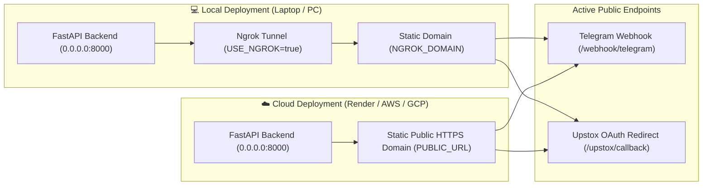
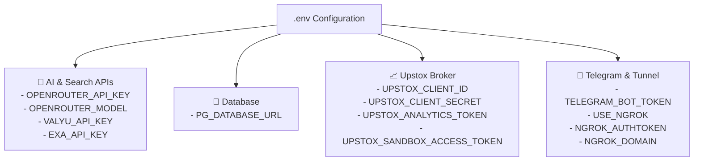
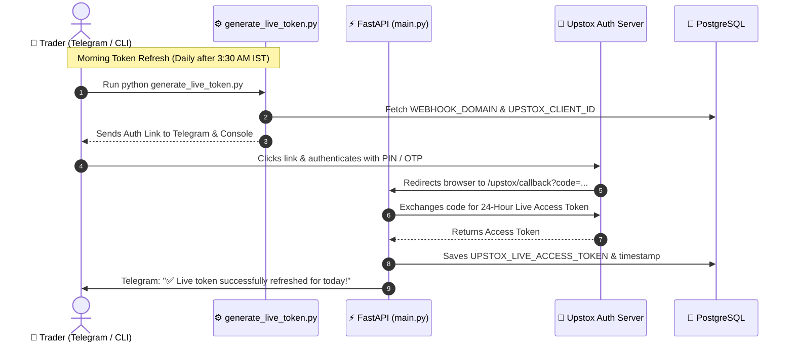
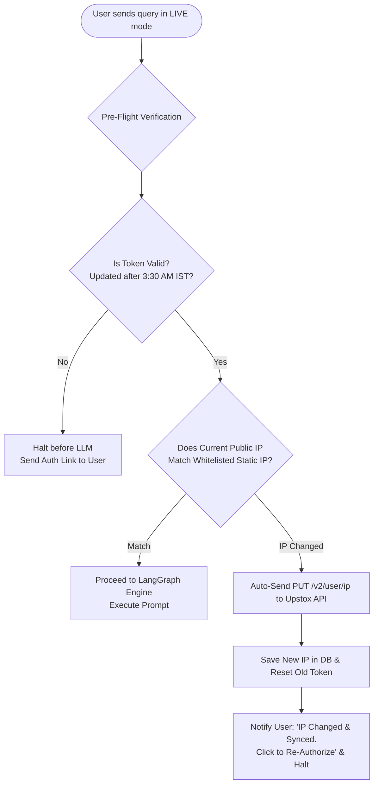
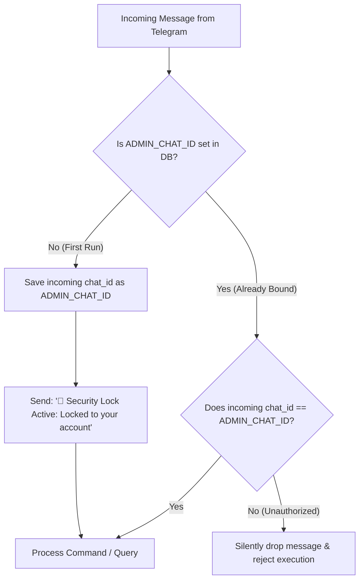
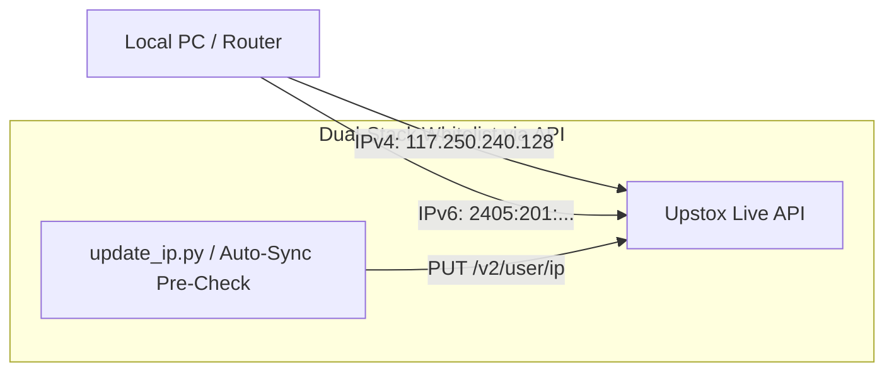

# DeepTrade: Setup & Architecture Guide



---

## Part 1: Environment Variables Setup (Where to fetch them)
Before starting DeepTrade, configure your `.env` file in the root directory. Below is the complete reference on where to obtain every required key:



### External AI & Search APIs
* **`OPENROUTER_API_KEY`**: Create an account at [OpenRouter.ai](https://openrouter.ai/) to access LLMs.
* **`OPENROUTER_MODEL`**: Set the specific model string (e.g., `poolside/laguna-s-2.1:free`, `nvidia/nemotron-3.5-lightning:free`, or `anthropic/claude-3.5-sonnet`).
* **`EXA_API_KEY`**: Sign up at [Exa.ai](https://exa.ai/) to get your API key for agentic web search and financial news retrieval.
* **`VALYU_API_KEY`**: Obtain your API key from [Valyu.network](https://valyu.network/) for real-time financial fundamentals and SEC filings.

### Database (PostgreSQL)
* **`PG_DATABASE_URL`**: Set up a PostgreSQL database (e.g., free tier on [Supabase](https://supabase.com/) or [Neon](https://neon.tech/)). 
  * Connection URI format: `postgresql://postgres.[ref]:[password]@[host]:5432/postgres`.
  * Persists user threads, query event streams, agent memory checkpoints, and bot configuration.

### Upstox API Credentials
1. Go to the [Upstox Developer Console](https://account.upstox.com/developer/apps).
2. **`UPSTOX_SANDBOX_ACCESS_TOKEN`**: From the **Sandbox** section, generate and copy the token for simulated paper trading.
3. **`UPSTOX_ANALYTICS_TOKEN`**: From the **Analytics** section, generate and copy the token for real-time and historical market quotes.
4. **`UPSTOX_CLIENT_ID` & `UPSTOX_CLIENT_SECRET`**: Create a **Live App** in the Upstox console. Copy the Client ID and Secret.
   * *Important:* You must set the Redirect URI in the Upstox portal to: `https://<your-domain>/upstox/callback` (e.g., `https://your-domain.ngrok-free.dev/upstox/callback`).

### Telegram Bot
* **`TELEGRAM_BOT_TOKEN`**: Open Telegram, search for `@BotFather`, and type `/newbot`. Follow the steps to name your bot and receive your HTTP API token.

### Server Deployment Settings
* **`USE_NGROK`**: Set to `true` if running locally on your laptop/PC, or `false` if deploying to the cloud.
* **`PUBLIC_URL`**: If hosting on a cloud provider (Render, GCP, AWS), paste your given static HTTPS domain here (e.g., `https://my-app.onrender.com`).
* **`NGROK_AUTHTOKEN` & `NGROK_DOMAIN`**: If using local testing (`USE_NGROK=true`), get your Authtoken and claim a static free domain from your [Ngrok Dashboard](https://dashboard.ngrok.com/).

---

## Part 2: Upstox Live Access Token Workflow



### 1. Inputs to the Script
When you run `generate_live_token.py`, it requires no manual arguments:
* **`UPSTOX_CLIENT_ID`**: Fetched from your `.env` file to identify your app to Upstox.
* **`WEBHOOK_DOMAIN`**: Checks PostgreSQL to find the verified domain your server is actively listening on.
* **Telegram Credentials**: Pulls `TELEGRAM_BOT_TOKEN` from `.env` and `ADMIN_CHAT_ID` from the database.

### 2. Output of the Script
* **Terminal Output**: Prints a clickable authorization link in your console.
* **Telegram Output**: Instantly sends a message to your Telegram bot with the clickable authorization link.

### 3. Step-by-Step Flow
1. **Trigger the script**: Run `python generate_live_token.py` (with `python main.py` running).
2. **Click the link**: Open the authorization link on your browser or Telegram.
3. **Upstox Login**: Enter your Upstox mobile number, OTP, and 6-digit PIN.
4. **The Callback (The Handoff)**: Upstox redirects back to `https://<your-domain>/upstox/callback`.
5. **The Server Takes Over**: The server intercepts the temporary code and exchanges it with Upstox for a fresh 24-Hour Live Access Token.
6. **Data Storage**: Permanently saves the token in PostgreSQL (`bot_settings`) with a current timestamp.
7. **Confirmation**: Sends a notification to Telegram: *"✅ Live token successfully refreshed for today!"*

---

## Part 3: Deterministic Pre-Flight IP & Token Verification



### Why Deterministic Pre-Flight Checks Matter:
Rather than letting an agent generate reasoning tokens and attempt tool calls that eventually fail with broker HTTP 403 errors, DeepTrade intercepts all requests *before* sending anything to the LLM:
1. **Token Lifetime**: Validates that the active token was generated today after 3:30 AM IST.
2. **Dynamic Public IP Detection**: Queries `https://api.ipify.org` in <100ms.
3. **Automated Whitelist Sync**: If your home WiFi or server IP changed, DeepTrade automatically invokes `PUT https://api.upstox.com/v2/user/ip` to update Upstox static IP settings without manual console configuration.

---

## Part 4: Deployment Architecture: Local (Ngrok) vs. Cloud

| Dimension | Local Deployment (`USE_NGROK=true`) | Cloud Deployment (`USE_NGROK=false`) |
| :--- | :--- | :--- |
| **Best For** | Development, rapid iteration, testing from laptop | 24/7 autonomous trading, scheduled morning tasks |
| **Domain Mechanism** | Ngrok static domain (e.g. `your-name.ngrok-free.dev`) | Cloud provider static URL (`PUBLIC_URL=https://...`) |
| **Upstox Redirect URI** | `https://your-name.ngrok-free.dev/upstox/callback` | `https://your-cloud-app.onrender.com/upstox/callback` |
| **Static IP Requirement** | Your local ISP IPv4 & IPv6 whitelisted via `update_ip.py` | Cloud provider static outbound IP whitelisted |

---

## Part 5: Single-User Security Lock (`ADMIN_CHAT_ID`)



DeepTrade enforces strict single-user ownership:
1. When deployed, `ADMIN_CHAT_ID` is empty.
2. The very **first person** to send `/start` permanently claims the bot.
3. All subsequent interactions from other Telegram accounts are silently dropped, preventing unauthorized trade executions.

---

## Part 6: Upstox Static IP Whitelisting & Dual-Stack IP Fix

Upstox requires developer accounts to whitelist their outbound IP address for live trading operations.



### The Dual-Stack IPv4 / IPv6 Solution:
Modern Indian ISPs (Jio, Airtel, ACT) route traffic to Upstox over IPv6. If only IPv4 is registered in the developer console, Upstox will reject orders with `UDAPI1154`.

To solve this, DeepTrade uses [update_ip.py](./update_ip.py) and internal pre-flight sync to automatically assign both IPv4 and IPv6 as `primary_ip` and `secondary_ip` via the Upstox API:

```bash
python update_ip.py
```