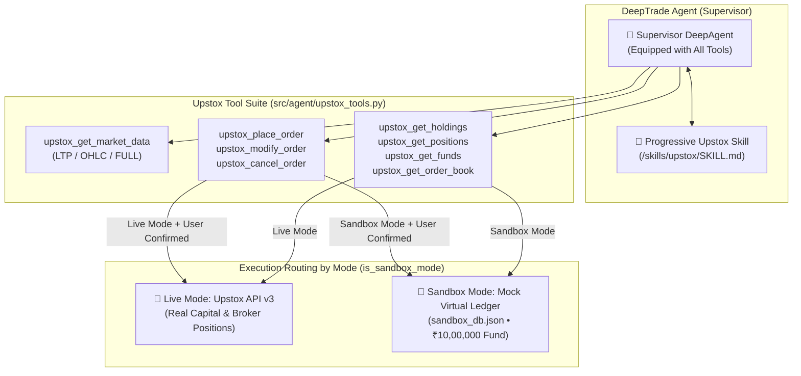
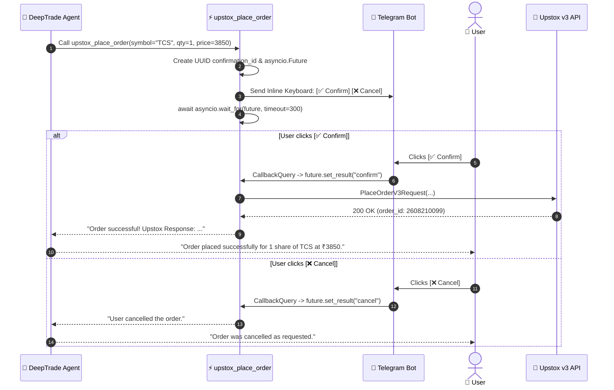
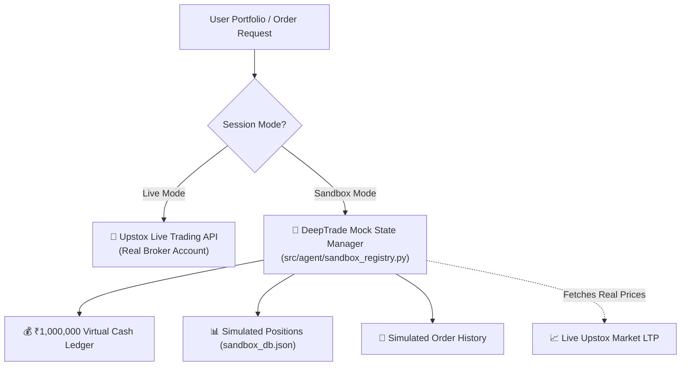

# Upstox Integration & Trading Skill Reference

---

## 1. DeepAgent & Skills Architecture

DeepTrade uses a **Single DeepAgent Architecture** (`Supervisor`) powered by DeepAgents and LangGraph.

- **Unified Tool Access**: The Supervisor has direct access to all search and trading tools.
- **Progressive Skill Loading**: The agent dynamically references `/skills/upstox/SKILL.md` to load critical rules regarding instrument key resolution, risk constraints, and interactive confirmation workflows.
- **Safety Enforcement**: The agent never executes live orders blindly. It initiates the pending order state and waits for human confirmation via Telegram inline buttons.

---

## 2. Upstox Tools Reference

All trading tools are defined in `src/agent/upstox_tools.py`:

### 1. `upstox_get_market_data`
- **Description**: Fetches real-time and historical quotes for a given instrument.
- **Parameters**:
  - `symbol` (str): Instrument ticker (e.g., `"TCS"`, `"RELIANCE"`, `"PCJEWELLER"`). Automatically resolved to Upstox key.
  - `data_type` (str):
    - `"LTP"`: Latest Traded Price.
    - `"OHLC"`: Open, High, Low, Close daily snapshot.
    - `"FULL"`: Full market depth and quote.
    - `"HISTORICAL"`: Past candlestick data.
  - `interval` (str, optional): Historical timeframe (e.g., `"1minute"`, `"day"`).

### 2. `upstox_place_order`
- **Description**: Prepares an order and generates an interactive confirmation prompt. Calling this tool automatically presents `[✅ Confirm]` and `[❌ Cancel]` buttons to the user.
- **Parameters**:
  - `symbol` (str): Instrument symbol.
  - `quantity` (int): Number of shares.
  - `transaction_type` (str): `"BUY"` or `"SELL"`.
  - `order_type` (str): `"MARKET"`, `"LIMIT"`, `"SL"`, `"SL-M"`.
  - `price` (float): Order limit price.

### 3. `upstox_modify_order`
- **Description**: Prepares an order modification and requests confirmation.
- **Parameters**:
  - `order_id` (str): Existing open order ID.
  - `quantity` (int): New quantity.
  - `price` (float): New price.
  - `order_type` (str): New order type.

### 4. `upstox_cancel_order`
- **Description**: Prepares an order cancellation and requests confirmation.
- **Parameters**:
  - `order_id` (str): Existing open order ID.

### 5. Portfolio Tools
- **`upstox_get_order_book`**: Fetches the user's list of all orders for today.
- **`upstox_get_holdings`**: Fetches long-term equity holdings.
- **`upstox_get_positions`**: Fetches current intraday and open F&O positions.
- **`upstox_get_funds`**: Fetches available cash balance, margin, and utilized collateral.

---

## 3. Two-Step Interactive Order Execution Lifecycle

---

## 4. Hybrid Live vs Sandbox Mode (Mock State Manager)

### Why DeepTrade Implements a Custom Sandbox Registry:
The official Upstox Sandbox API only supports order placement and modification—it lacks endpoints for checking simulated funds, positions, and order history.

DeepTrade overcomes this limitation with `src/agent/sandbox_registry.py`:
1. **Real Market Pricing in Sandbox**: Uses the real `UPSTOX_ANALYTICS_TOKEN` to pull actual live prices for paper trades.
2. **Virtual Capital Ledger**: Initializes with ₹1,000,000 virtual balance. Simulated BUY/SELL orders update virtual cash and positions in `sandbox_db.json`.
3. **Isolated Portfolio Views**: Querying `/sandbox` holdings or positions reflects your paper trading ledger without touching real money.

---

## 5. Supported Telegram Commands

| Command | Description |
| :--- | :--- |
| `/start` or `/help` | Shows welcome message, bot status, and command list. |
| `/new` | Clears conversation state and memory checkpoint in PostgreSQL. |
| `/sandbox` | Switches the user session into Sandbox Mode (simulated paper trading). |
| `/live` | Switches the user session into Live Mode (real money orders). |
| `/analyse <ticker>` | Initiates comprehensive technical & fundamental equity research. |
| `/news <topic>` | Fetches and summarizes latest news and catalysts for a ticker/topic. |
| `/deepdive <topic>` | Conducts an exhaustive multi-agent research report. |
